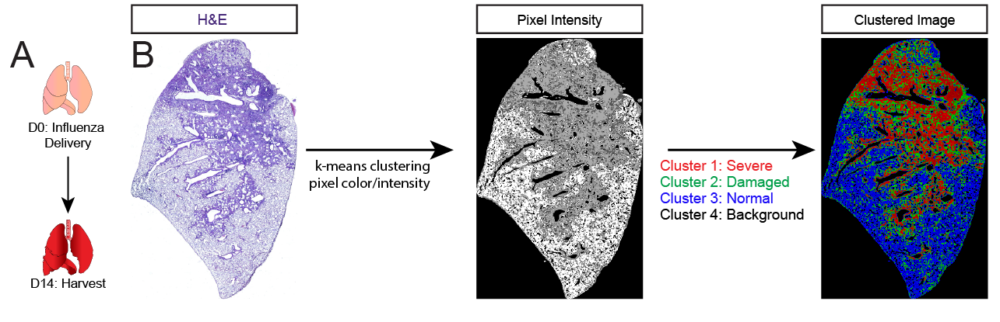
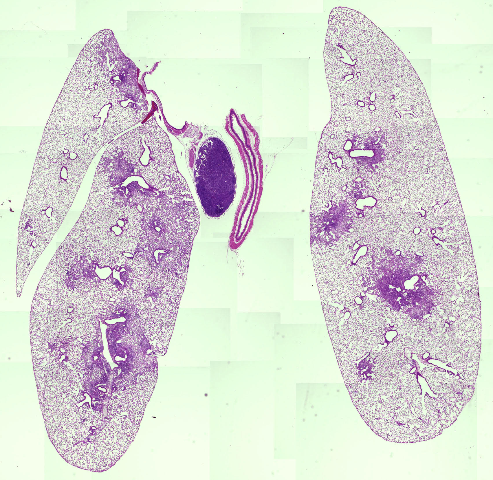
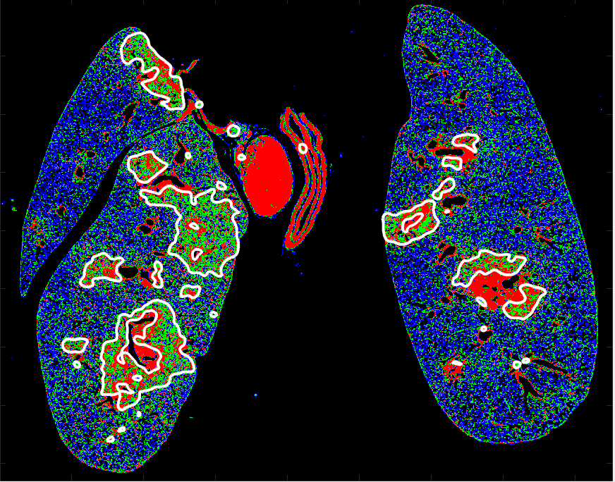
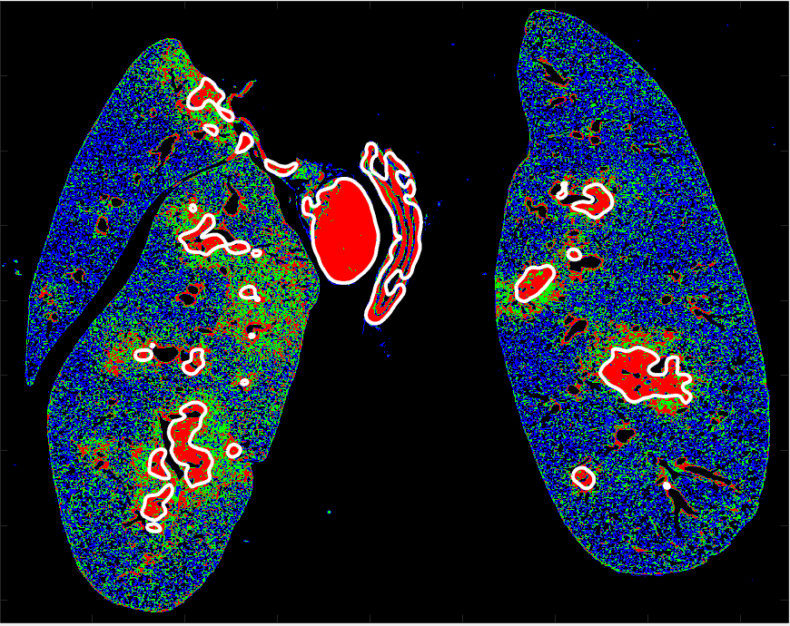

# LungDamage
Quantify tissue damage with ML



### Contact and Referencing

Any comments or questions can be directed to: Will Liberti at bliberti@bu.edu


If you use this in your work, please cite:

*Alveolar epithelial cell fate is maintained in a spatially restricted manner to promote lung regeneration after acute injury, _Liberti et al._ * 


### Basic Walkthrough


Take this example image:


```
>> % cd('images'); enter the images directory

>> RGB1 = DL_demo % load 'image00.jpg'
```


Isolate the moderately damaged tissue:


Isolate just the severely damaged tissue:



## Clustering multipe images

Sometimes you will want to cluster several images, or cluster relative to a known healthy, or known damaged  reference sample.


```
>> % cd('images/Unprocessed')
>> out = DL_demo_ref('S.jpg')
```
